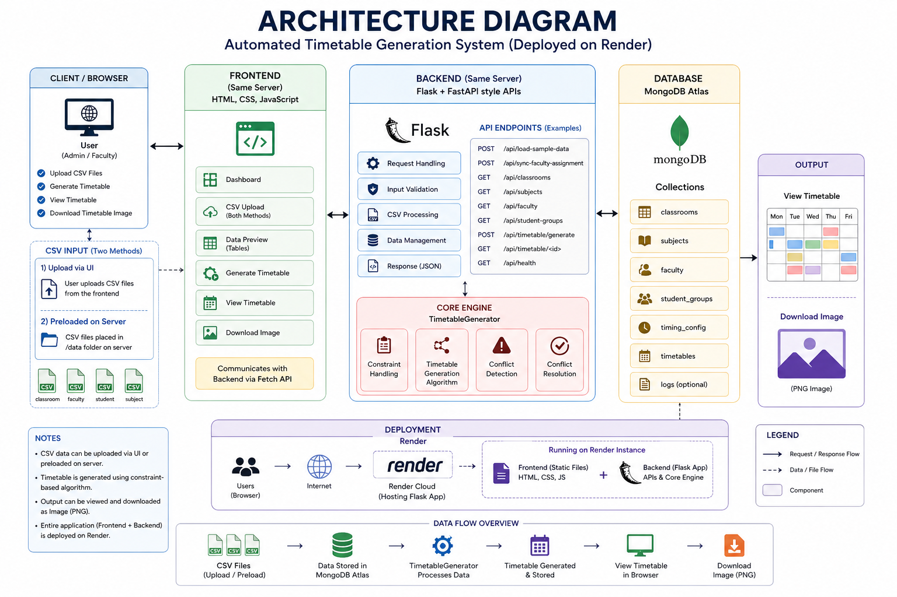
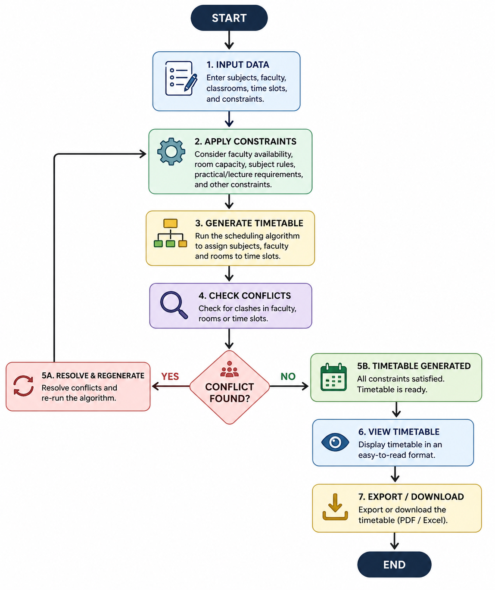

# 🎓 EduSched – Smart Timetable Generator

<p align="center">
  <b>Automate • Optimize • Simplify Scheduling</b>
</p>

<p align="center">
  
  
  
  
</p>

---

## 🚀 About The Project

EduSched is a smart timetable generation system that automates scheduling using CSV inputs and constraint-based logic.

---

## 🖼️ Architecture Diagram

> Save your diagram as `architecture.png` inside repo and it will display automatically.



---

## 🔄 Workflow

> Save your flowchart as `workflow.png`



---

## ✨ Features

✔ CSV-based input system  
✔ Automatic timetable generation  
✔ Clean UI (HTML, CSS, JS)  
✔ Image export  
✔ FastAPI + Flask backend  
✔ MongoDB Atlas integration  

---

## 🏗️ Architecture

Frontend → Flask → FastAPI → MongoDB Atlas

---

## ⚙️ Setup

```bash
git clone https://github.com/your-username/EduSched.git
cd EduSched

python -m venv venv
venv\Scripts\activate

pip install -r requirements.txt

uvicorn main:app --reload --port 8001
python app.py
```

Open: http://127.0.0.1:5000

---

## 🧠 How It Works

1. Upload CSV  
2. Apply constraints  
3. Generate timetable  
4. Detect conflicts  
5. Resolve & regenerate  
6. View & download  

---

## 🛠️ Tech Stack

- HTML, CSS, JavaScript  
- Flask, FastAPI  
- MongoDB Atlas  
- Render  

---

## 👨‍💻 Author

Shashwat Mandali

---

## ⭐ Support

Star ⭐ | Fork 🍴 | Contribute 🚀
